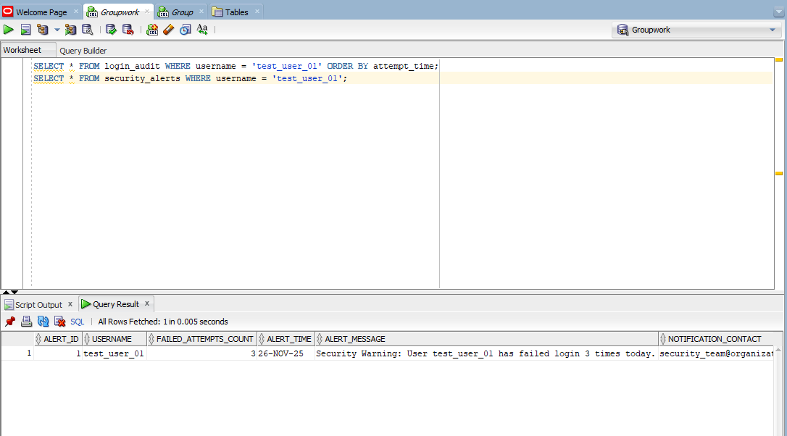
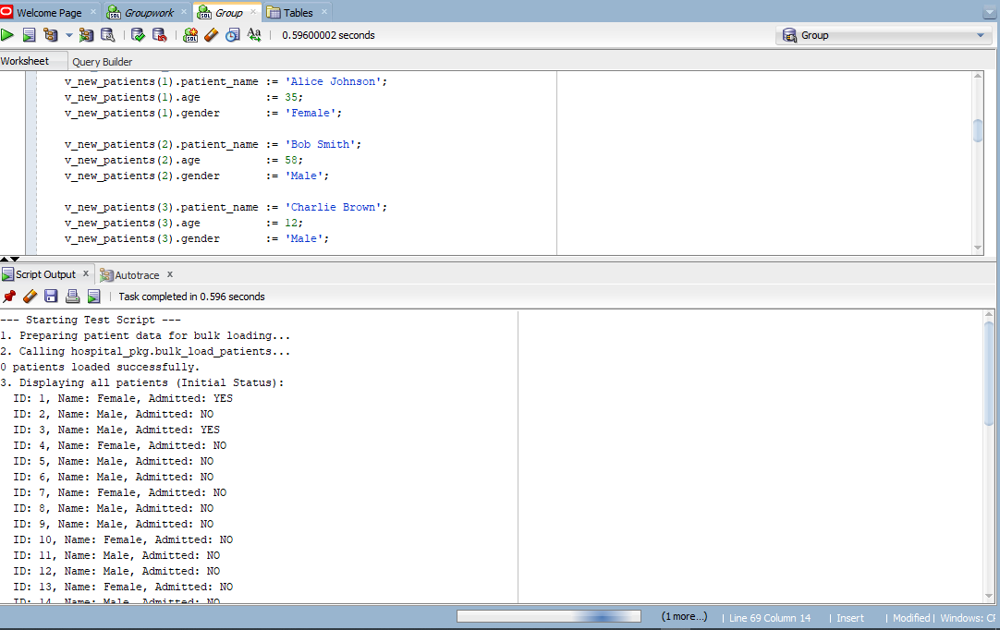
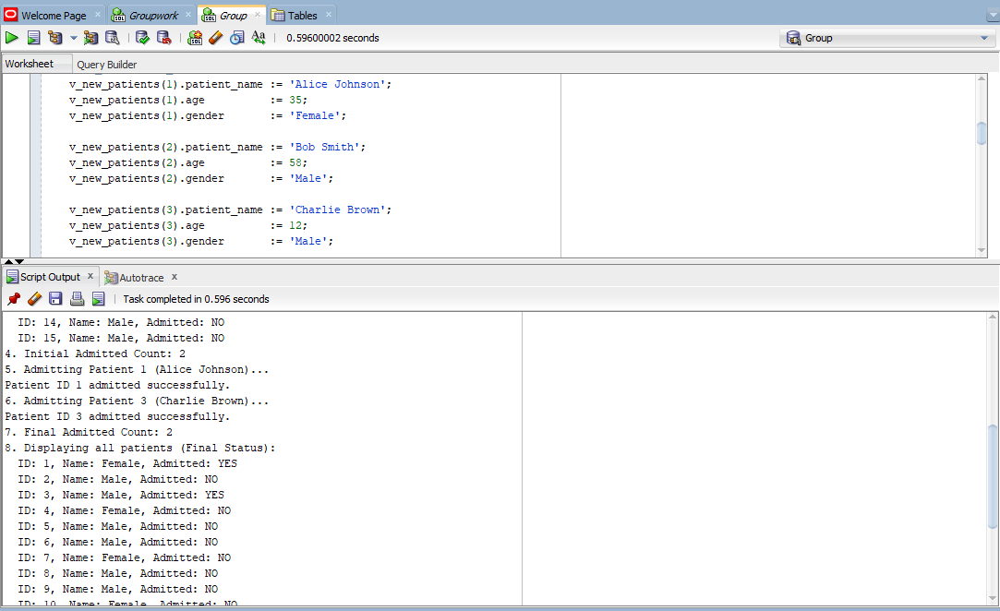
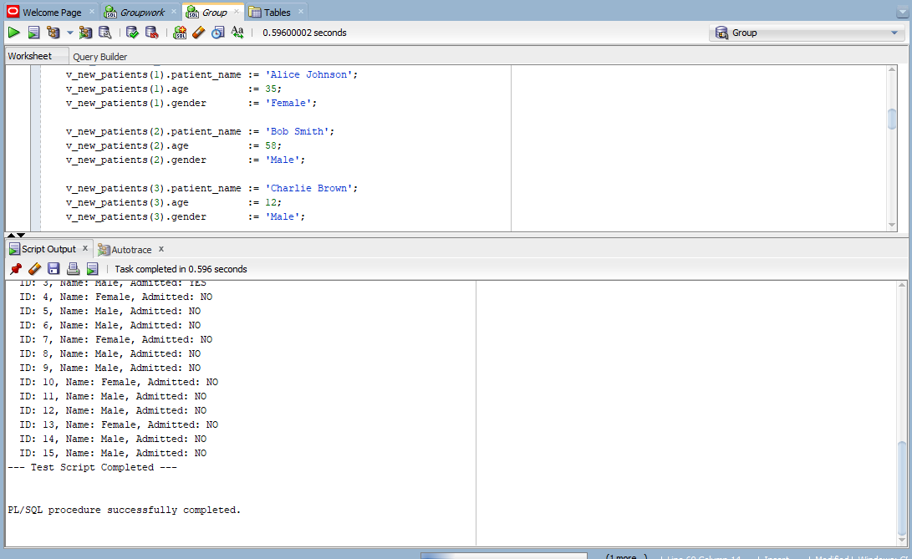

# 🧠 PL/SQL  Scenarios about triggers & package in PLSQL Group Work 📘

---

## 👤 Members

- **IRAKOZE NSHUTI FABRICE(28264)**
- **MURIHIRA MUHIRE ARSENE(27656)**
- **IRASUBIZA PACIFIQUE(27983)**
- **MUCYO KEVIN(26607)**
- **MUTINDA COLLINS(27842)**
- **NAMAHORO ISAACAR(28281)**
- **KAREMERA HERO HIGIRO(28609)**

---

# 🔒 Oracle Security Policy Implementation: Suspicious Login Monitor

## 🛡️ Project Overview
This project implements a crucial security policy within an Oracle Database environment. It monitors failed login attempts for every user on a per-day basis and automatically triggers a security alert and email notification when a threshold of two consecutive failures is exceeded.

The solution utilizes Triggers, Stored Procedures, and a Package to adhere to Oracle's best practices and successfully handle the "Mutating Table" issue (ORA-04091).

---

## ⚙️ Task 1: Create Tables

### 📂 1. login_audit Table

``` sql
CREATE TABLE login_audit (
    audit_id NUMBER GENERATED BY DEFAULT AS IDENTITY PRIMARY KEY,
    username VARCHAR2(100) NOT NULL,
    attempt_time DATE DEFAULT SYSDATE,
    status VARCHAR2(10) NOT NULL,
    ip_address VARCHAR2(45)
);
```

### 📂 2. security_alerts Table

``` sql
CREATE TABLE security_alerts (
    alert_id NUMBER GENERATED BY DEFAULT AS IDENTITY PRIMARY KEY,
    username VARCHAR2(100),
    failed_attempts_count NUMBER,
    alert_time DATE DEFAULT SYSDATE,
    alert_message VARCHAR2(500),
    notification_contact VARCHAR2(150)
);
```

### ⚠️ 3. Trigger: Detect & Alert Suspicious Login Activity

``` sql
CREATE OR REPLACE TRIGGER trg_check_suspicious_login
AFTER INSERT ON login_audit
FOR EACH ROW
DECLARE
    v_fail_count NUMBER;
    v_contact VARCHAR2(150) := 'security_team@organization.com';
BEGIN
    IF :NEW.status = 'FAILED' THEN
        SELECT COUNT(*)
        INTO v_fail_count
        FROM login_audit
        WHERE username = :NEW.username 
          AND status = 'FAILED'
          AND TRUNC(attempt_time) = TRUNC(SYSDATE);
        IF v_fail_count > 2 THEN
            INSERT INTO security_alerts (
                username, 
                failed_attempts_count, 
                alert_time, 
                alert_message, 
                notification_contact
            )
            VALUES (
                :NEW.username, 
                v_fail_count, 
                SYSDATE, 
                'Security Warning: User ' || :NEW.username || ' has failed login ' || v_fail_count || ' times today.',
                v_contact
            );
        END IF;
    END IF;
END;/

```

### 📧 4.Stored Procedure for Email 📧

``` sql
CREATE OR REPLACE PROCEDURE send_security_notification (
    p_recipient IN VARCHAR2,
    p_subject IN VARCHAR2,
    p_body IN VARCHAR2
)
IS
BEGIN
    -- UTL_MAIL requires the SMTP server to be configured in the database
    UTL_MAIL.send(
        sender     => 'db_alert@organization.com',
        recipients => p_recipient,
        subject    => p_subject,
        message    => p_body
    );
EXCEPTION
    WHEN OTHERS THEN
        -- Log the error instead of stopping the main process
        DBMS_OUTPUT.PUT_LINE('Error sending email: ' || SQLERRM);
        -- In a production environment, you would log this to an error table
END;
/
```

### 5. 🧩Trigger to Call the Email Procedure

```sql
CREATE OR REPLACE TRIGGER trg_alert_email_notify
AFTER INSERT ON security_alerts
FOR EACH ROW
BEGIN
    send_security_notification(
        p_recipient => :NEW.notification_contact,
        p_subject   => 'CRITICAL ALERT: Repeated Failed Logins for ' || :NEW.username,
        p_body      => :NEW.alert_message || CHR(10) || 'Time: ' || TO_CHAR(:NEW.alert_time, 'YYYY-MM-DD HH24:MI:SS')
    );
END;
/
```

### 5. 🧪 Final Verification and Testing
#### Insertion

```sql
INSERT INTO login_audit (username, status, ip_address) VALUES ('test_user_01', 'FAILED', '192.168.1.10');

INSERT INTO login_audit (username, status, ip_address) VALUES ('test_user_01', 'FAILED', '192.168.1.10');

INSERT INTO login_audit (username, status, ip_address) VALUES ('test_user_01', 'FAILED', '192.168.1.10');

```

#### Testing

```sql
SELECT * FROM login_audit WHERE username = 'test_user_01' ORDER BY attempt_time;
SELECT * FROM security_alerts WHERE username = 'test_user_01';
```

#### 📸 Screenshot – *Testing*


---

------------------------------------------------------------------------------------------------------------

# 🏥 Part II --- Hospital Management PL/SQL Package

## ✨ Overview
This repository contains the Oracle PL/SQL package designed to streamline Patient and Doctor Management for a hospital system. The core feature is the implementation of bulk processing (using FORALL) for efficient insertion of multiple patient records, drastically improving performance over row-by-row processing.

The package provides critical functionalities, including patient admission tracking and comprehensive patient information retrieval via a REF CURSOR function.

---

## 🗂️ 1. Required Tables

### patients Table

``` sql
CREATE TABLE patients (
    patient_id      NUMBER PRIMARY KEY,
    patient_name    VARCHAR2(100) NOT NULL,
    age             NUMBER,
    gender          VARCHAR2(10) CHECK (gender IN ('Male', 'Female', 'Other')),
    admitted_status VARCHAR2(3) DEFAULT 'NO' CHECK (admitted_status IN ('YES', 'NO'))
);
```

### doctors Table

``` sql
CREATE TABLE doctors (
    doctor_id       NUMBER PRIMARY KEY,
    doctor_name     VARCHAR2(100) NOT NULL,
    specialty       VARCHAR2(50)
);
```

### Sequence for patient_id

```sql
CREATE SEQUENCE patient_seq START WITH 1 INCREMENT BY 1;

COMMIT;
```
------------------------------------------------------------------------

# 📦 2. Package Specification

``` sql
CREATE OR REPLACE PACKAGE hospital_pkg AS
    TYPE patient_rec IS RECORD (
        patient_id      patients.patient_id%TYPE,
        patient_name    patients.patient_name%TYPE,
        age             patients.age%TYPE,
        gender          patients.gender%TYPE
    );

    TYPE patient_tbl IS TABLE OF patient_rec INDEX BY PLS_INTEGER;

    PROCEDURE bulk_load_patients (
        p_patients_list IN patient_tbl
    );

    FUNCTION show_all_patients RETURN SYS_REFCURSOR;

    FUNCTION count_admitted RETURN NUMBER;

    PROCEDURE admit_patient (
        p_patient_id IN patients.patient_id%TYPE
    );

END hospital_pkg;
/
```

------------------------------------------------------------------------

# 🧠 3. Package Body

``` sql
CCREATE OR REPLACE PACKAGE BODY hospital_pkg AS

    PROCEDURE bulk_load_patients (
        p_patients_list IN patient_tbl
    )
    AS
    BEGIN
        FORALL i IN p_patients_list.FIRST..p_patients_list.LAST
            INSERT INTO patients (patient_id, patient_name, age, gender)
            VALUES (patient_seq.NEXTVAL, 
                    p_patients_list(i).patient_name, 
                    p_patients_list(i).age, 
                    p_patients_list(i).gender);

        COMMIT;
        DBMS_OUTPUT.PUT_LINE(SQL%ROWCOUNT || ' patients loaded successfully.');

    EXCEPTION
        WHEN OTHERS THEN
            ROLLBACK;
            RAISE;
    END bulk_load_patients;

    FUNCTION show_all_patients RETURN SYS_REFCURSOR
    AS
        v_cursor SYS_REFCURSOR;
    BEGIN
        OPEN v_cursor FOR
            SELECT patient_id, patient_name, age, gender, admitted_status
            FROM patients
            ORDER BY patient_id;

        RETURN v_cursor;
    END show_all_patients;

    FUNCTION count_admitted RETURN NUMBER
    AS
        v_count NUMBER;
    BEGIN
        SELECT COUNT(*)
        INTO v_count
        FROM patients
        WHERE admitted_status = 'YES';

        RETURN v_count;
    END count_admitted;

    PROCEDURE admit_patient (
        p_patient_id IN patients.patient_id%TYPE
    )
    AS
    BEGIN
        UPDATE patients
        SET admitted_status = 'YES'
        WHERE patient_id = p_patient_id;

        IF SQL%ROWCOUNT = 0 THEN
            RAISE_APPLICATION_ERROR(-20001, 'Patient ID ' || p_patient_id || ' not found.');
        END IF;

        COMMIT;
        DBMS_OUTPUT.PUT_LINE('Patient ID ' || p_patient_id || ' admitted successfully.');

    EXCEPTION
        WHEN OTHERS THEN
            ROLLBACK;
            RAISE;
    END admit_patient;

END hospital_pkg;
/
```

------------------------------------------------------------------------

# 🧪 Part IV --- Test Scripts

## ⭐ Bulk Load Patients

``` sql
SET SERVEROUTPUT ON;

DECLARE
    v_new_patients hospital_pkg.patient_tbl;
    
    v_patient_cursor SYS_REFCURSOR;
    v_patient_id      patients.patient_id%TYPE;
    v_patient_name    patients.patient_name%TYPE;
    v_admitted_status patients.admitted_status%TYPE;
    
    v_admitted_count  NUMBER;
BEGIN
    DBMS_OUTPUT.PUT_LINE('--- Starting Test Script ---');
    
    DBMS_OUTPUT.PUT_LINE('1. Preparing patient data for bulk loading...');
    v_new_patients(1).patient_name := 'Alice Johnson';
    v_new_patients(1).age          := 35;
    v_new_patients(1).gender       := 'Female';

    v_new_patients(2).patient_name := 'Bob Smith';
    v_new_patients(2).age          := 58;
    v_new_patients(2).gender       := 'Male';

    v_new_patients(3).patient_name := 'Charlie Brown';
    v_new_patients(3).age          := 12;
    v_new_patients(3).gender       := 'Male';
    
    DBMS_OUTPUT.PUT_LINE('2. Calling hospital_pkg.bulk_load_patients...');
    hospital_pkg.bulk_load_patients(v_new_patients);
    
    DBMS_OUTPUT.PUT_LINE('3. Displaying all patients (Initial Status):');
    v_patient_cursor := hospital_pkg.show_all_patients();
    
    LOOP
        FETCH v_patient_cursor INTO v_patient_id, v_patient_name, v_admitted_status, v_patient_name, v_admitted_status;
        EXIT WHEN v_patient_cursor%NOTFOUND;
        DBMS_OUTPUT.PUT_LINE('  ID: ' || v_patient_id || ', Name: ' || v_patient_name || ', Admitted: ' || v_admitted_status);
    END LOOP;
    CLOSE v_patient_cursor;

    v_admitted_count := hospital_pkg.count_admitted();
    DBMS_OUTPUT.PUT_LINE('4. Initial Admitted Count: ' || v_admitted_count);
    
    DBMS_OUTPUT.PUT_LINE('5. Admitting Patient 1 (Alice Johnson)...');
    hospital_pkg.admit_patient(p_patient_id => 1);
    
    DBMS_OUTPUT.PUT_LINE('6. Admitting Patient 3 (Charlie Brown)...');
    hospital_pkg.admit_patient(p_patient_id => 3);
    
    v_admitted_count := hospital_pkg.count_admitted();
    DBMS_OUTPUT.PUT_LINE('7. Final Admitted Count: ' || v_admitted_count);
    
    DBMS_OUTPUT.PUT_LINE('8. Displaying all patients (Final Status):');
    v_patient_cursor := hospital_pkg.show_all_patients();
    
    LOOP
        FETCH v_patient_cursor INTO v_patient_id, v_patient_name, v_admitted_status, v_patient_name, v_admitted_status;
        EXIT WHEN v_patient_cursor%NOTFOUND;
        DBMS_OUTPUT.PUT_LINE('  ID: ' || v_patient_id || ', Name: ' || v_patient_name || ', Admitted: ' || v_admitted_status);
    END LOOP;
    CLOSE v_patient_cursor;
    
    DBMS_OUTPUT.PUT_LINE('--- Test Script Completed ---');
    
EXCEPTION
    WHEN OTHERS THEN
        DBMS_OUTPUT.PUT_LINE('An error occurred: ' || SQLERRM); 
END;
/
```

#### 📸 Screenshot – *Testing*

---

---


---


------------------------------------------------------------------------


